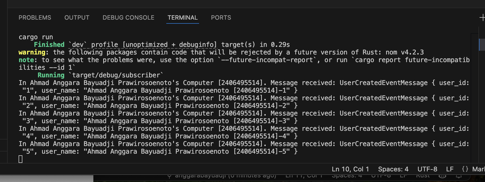

# Software Architecture - Modul 9: Subscriber

1.  What is amqp?

AMQP atau Advanced Message Queuing Protocol adalah sebuah protokol standar terbuka pada lapisan aplikasi yang dirancang khusus untuk komunikasi pesan antar sistem yang berbeda. Protokol ini menyediakan kerangka kerja yang sangat kuat untuk pengiriman pesan secara asinkron, sehingga menjamin data terkirim dengan andal dan aman meskipun melalui platform atau bahasa pemrograman yang beragam. AMQP secara spesifik mendefinisikan bagaimana pesan harus dirutekan melalui exchange dan disimpan di dalam antrean (queue) sebelum akhirnya diambil oleh penerima yang dituju. Dengan memanfaatkan protokol ini, pengembang dapat membangun sistem terdistribusi yang skalabel dengan memisahkan ketergantungan atau decoupling antara pengirim pesan dan penerima pesan. Protokol ini bertindak sebagai bahasa komunikasi universal yang memungkinkan layanan, seperti subscriber berbasis Rust yang sedang Anda buat, untuk berinteraksi secara lancar dengan broker pesan seperti RabbitMQ. Fitur utama seperti konfirmasi pengiriman pesan (acknowledgments) dan penyimpanan data yang persisten menjadikan AMQP standar industri dalam arsitektur perangkat lunak modern.

2.  What does it mean? guest:guest@localhost:5672 , what is the first guest, and what is the second guest, and what is localhost:5672 is for?

String koneksi `guest:guest@localhost:5672` adalah format URI standar yang digunakan untuk menentukan parameter autentikasi serta lokasi jaringan agar aplikasi dapat terhubung ke server RabbitMQ. Di dalam struktur string tersebut, kata "guest" yang pertama merepresentasikan nama pengguna (username) default yang digunakan untuk proses masuk ke dalam sistem broker. Kata "guest" yang kedua merupakan kata sandi (password) default yang secara otomatis dipasangkan dengan akun tersebut oleh sistem RabbitMQ. Bagian "localhost" dalam alamat tersebut menunjukkan bahwa broker pesan sedang berjalan di mesin atau komputer lokal yang sama dengan aplikasi yang sedang dijalankan. Sementara itu, angka "5672" merupakan nomor port TCP standar yang dialokasikan khusus bagi protokol AMQP untuk menerima koneksi dari klien. Informasi ini sangat krusial karena tanpa kombinasi kredensial dan alamat port yang tepat, aplikasi subscriber tidak akan bisa membangun saluran komunikasi dengan layanan antrean pesan. Gabungan seluruh elemen ini memastikan bahwa aplikasi Anda mengetahui identitas siapa yang masuk dan ke mana arah koneksi harus ditujukan.

Gambar di atas menunjukkan terminal dari program subscriber yang berhasil menerima dan memproses lima buah pesan yang dikirimkan oleh program publisher melalui RabbitMQ. Setelah program subscriber dijalankan menggunakan perintah cargo run, aplikasi tersebut memasuki mode standby untuk mendengarkan antrean (queue) bernama user_created. Segera setelah program publisher mengeksekusi pengiriman lima event, subscriber menangkap pesan-pesan tersebut secara real-time dan asinkron. Output pada terminal menampilkan data UserCreatedEventMessage yang telah dideserialisasi, mencakup user_id dan user_name yang menyertakan identitas Ahmad Anggara Bayuadji Prawirosoenoto [2406495514]. Hal ini membuktikan bahwa arsitektur event-driven menggunakan protokol AMQP telah terimplementasi dengan benar, di mana pesan berhasil diteruskan dari publisher ke broker, dan akhirnya sampai ke subscriber dengan integritas data yang terjaga.